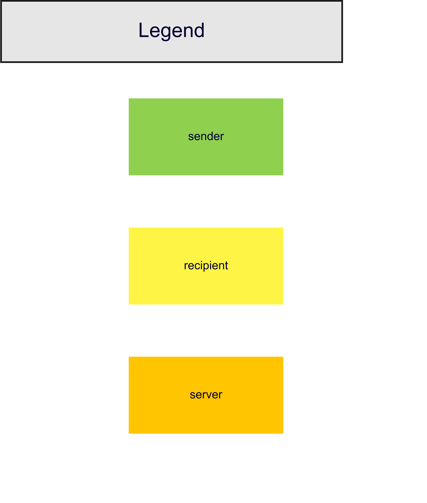
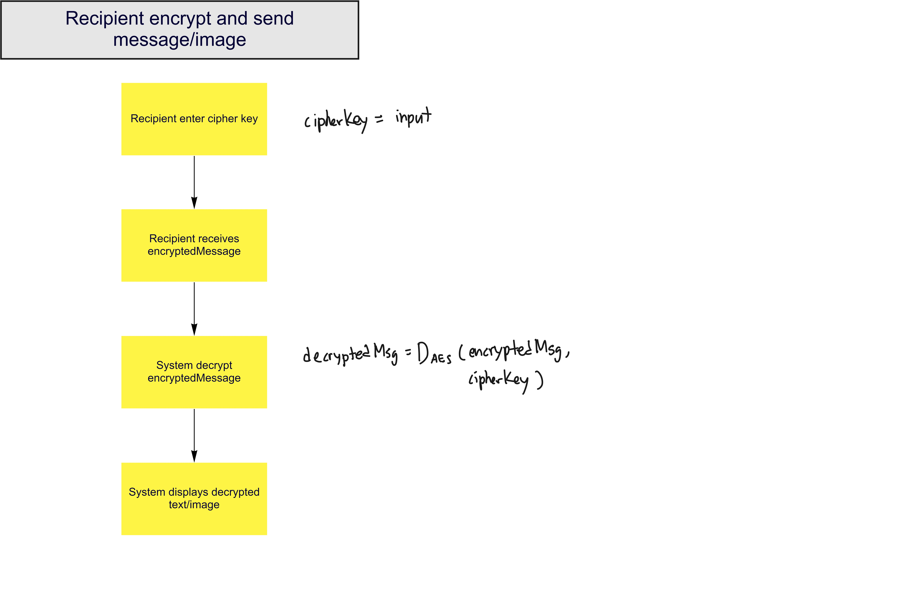
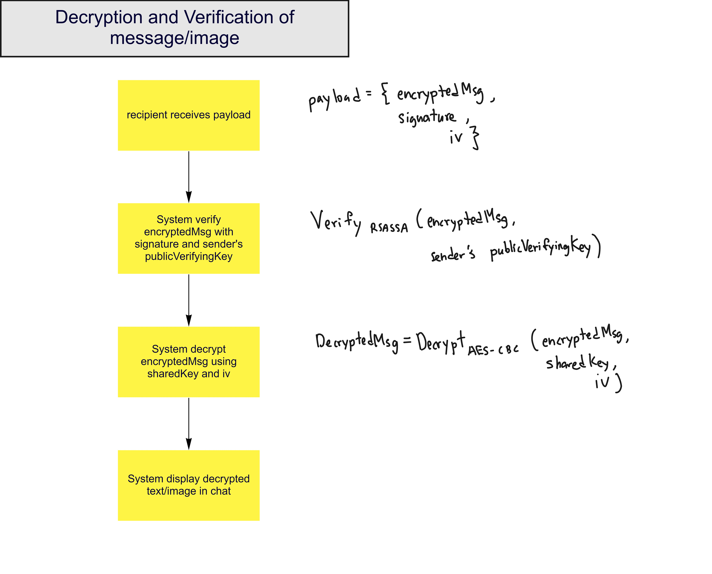

# 📄 🔒 ☁️ ⏩ Encrypted File Share 📥 🔐 📄

👉 [https://encrypted-fileshare.ml](https://encrypted-fileshare.ml) 👈

✅ Proof-of-concept application built using NextJS, Express, Socket.io and Google OAuth to enable secure file sharing between two clients, sender and receiver, without giving full trust to the server.

<details open>
    <summary>Table of Contents</summary>
<ul>
    <li><a href="#-demo-video">Demo Video</a></li>
    <li><a href="#-tech-stack">Tech Stack</a></li>
    <li><a href="#-folder-and-file-structure">Folder And File Structure</a></li>
    <li><a href="#-architecture-of-the-app">Architecture Of The App</a></li>
    <li><a href="#-run-locally-for-development">Run Locally (for development)</a></li>
    <li><a href="#-hosting-for-production">Hosting (for production)</a></li>
    <li><a href="#-automatically-generating-changelog">Automatically Generating Changelog</a></li>
    <li><a href="#-changelog">Changelog</a></li>
    <li><a href="#-authors">Authors</a></li>
</ul>
</details>
<p>

## 📹 Demo Video

{ insert demo video here }

## 🥞 Tech Stack

**Client**:

- [NextJS](http://nextjs.org) a React framework
- [ChakraUI](http://chakra-ui.com) user interface library

**Server**:

- [NodeJS](https://nodejs.org)
- [Express](https://expressjs.com)
- Socket.io

**Authentication**:

- [Firebase](https://firebase.google.com/docs/auth)

**Crytography**:

- Symmetric encryption: [crypto-js](https://cryptojs.gitbook.io/docs/)

  - AES-256 for symmetric key

- Asymmetric encryption: [SubtleCrypto](https://developer.mozilla.org/en-US/docs/Web/API/SubtleCrypto)

  - AES-CBC-256 for symmetric key
  - RSA-OAEP-SHA256 for encryption/decryption of the symmetric key
  - RSASSA-PKCS1-v1_5-SHA-256 for signing/verifying of the payload

## 🗂 Folder And File Structure

```bash
encrypted-file-share-applied-cryptography
├─ 🗂 nextjs-client                    # Next.js client main folder
│  ├─ 🗂 interface                     # contains type definitions for message objects
│  │  └─ index.ts
│  ├─ 🗂 public                        # contains public files, favicon, robots.txt, etc.
│  ├─ 🗂 src                           # contains all the source code for the client
│  │  ├─ 🗂 pages                      # pages for the client [/, /auth, /symmetric-room, /asymmetric-room]
│  │  │  ├─ _app.tsx
│  │  │  ├─ _document.tsx
│  │  │  ├─ asymmetric-room.tsx
│  │  │  ├─ auth.tsx                   # sign in with Google
│  │  │  ├─ index.tsx                  # main page to select the room
│  │  │  └─ symmetric-room.tsx
│  │  ├─ 🗂 utils                      # utility functions for the client
│  │  │  ├─ asymSocket.ts
│  │  │  ├─ cryptography.ts
│  │  │  ├─ firebase.ts
│  │  │  ├─ firebaseConfig.ts          # replace with your own firebase credentials
│  │  │  ├─ firebaseConfig.example.ts  # example firebase credentials
│  │  │  ├─ socket.ts
│  │  │  └─ toBase64.ts
│  │  └─ theme.tsx                     # set the theme for the client
│  ├─ Dockerfile                       # Dockerfile for the client
│  ├─ next-env.d.ts
│  ├─ package-lock.json
│  ├─ package.json
│  └─ tsconfig.json
├─ 🗂 socket-server                     # Socket.io server main folder
│  ├─ 🗂 dist                           # contains the compiled server code
│  │  ├─ server.js
│  │  └─ server.js.map
│  ├─ 🗂 src
│  │  └─ server.ts                      # main server file
│  ├─ Dockerfile                        # Dockerfile for the server
│  ├─ package-lock.json
│  ├─ package.json
│  └─ tsconfig.json
├─ CHANGELOG.md
├─ README.md                        # main README
├─ docker-compose.yml               # Docker compose file that runs client and server
├─ package-lock.json
└─ package.json
```

## 🏛 Architecture Of The App

### Legend



### Symmetric (/symmetric-room)

#### Encryption


#### Decryption



### Asymmetric (/asymmetric-room)

#### Connect to room


#### Shared key


#### Encrypt and Sign


#### Decrypt and Verify



## 👨🏻‍💻 Run Locally (for development)

> You need to obtain `nextjs-client/src/utils/firebaseConfig.ts` from authors, file has been omitted from repository for it contains credentials to access firebase OR! you can take a look at [firebaseConfig.example.ts](./nextjs-client/src/utils/firebaseConfig.example.ts) and replace it with your own firebase project credentials. [Click here to learn how to get your own firebase credentials](https://firebase.google.com/docs/web/setup)

Clone the project

```bash
git clone https://github.com/OkkarMin/encrypted-file-share-applied-cryptography
```

Go to the project directory

```bash
cd encrypted-file-share-applied-cryptography
```

Install dependencies

```bash
npm run installDeps
```

Run command below to run both socket-server and nextjs-client

```bash
npm run dev
```

- nextjs-client : http://localhost:3000
- socket-server : http://localhost:2000

## 🌍 Hosting (for production)

Client and Server has been dockerized for ease of hosting. `docker-compose.yml` ties two Dockerfiles together to expose client and server at the same time.

```bash
cd encrypted-file-share-applied-cryptography
docker-compose up --build
```

### Client Dockerfile (nextjs-client/Dockerfile)

```Dockerfile
# Install dependencies only when needed
FROM node:alpine AS deps
# Check https://github.com/nodejs/docker-node/tree/b4117f9333da4138b03a546ec926ef50a31506c3#nodealpine to understand why libc6-compat might be needed.
RUN apk add --no-cache libc6-compat
WORKDIR /app
COPY package.json ./
RUN yarn install --frozen-lockfile

# Rebuild the source code only when needed
FROM node:alpine AS builder
WORKDIR /app
COPY . .
COPY --from=deps /app/node_modules ./node_modules
RUN yarn build && yarn install --production --ignore-scripts --prefer-offline

# Production image, copy all the files and run next
FROM node:alpine AS runner
WORKDIR /app

ENV NODE_ENV production

RUN addgroup -g 1001 -S nodejs
RUN adduser -S nextjs -u 1001

# You only need to copy next.config.js if you are NOT using the default configuration
# COPY --from=builder /app/next.config.js ./
COPY --from=builder /app/public ./public
COPY --from=builder --chown=nextjs:nodejs /app/.next ./.next
COPY --from=builder /app/node_modules ./node_modules
COPY --from=builder /app/package.json ./package.json

USER nextjs

EXPOSE 3000

# Next.js collects completely anonymous telemetry data about general usage.
# Learn more here: https://nextjs.org/telemetry
# Uncomment the following line in case you want to disable telemetry.
# ENV NEXT_TELEMETRY_DISABLED 1

CMD ["yarn", "start"]
```

### Server Dockerfile (socket-server/Dockerfile)

```Dockerfile
FROM node:14.17.1 as deps

# Add package file
COPY package*.json ./

# Install deps
RUN npm i

# Copy source
COPY src ./src
COPY tsconfig.json ./tsconfig.json

# Build dist
RUN npm run build

# Start production image build
FROM node:12-alpine as prod

# Copy node modules and build directory
COPY --from=deps ./node_modules ./node_modules
COPY --from=deps /dist /dist

# Copy static files
# COPY src/public dist/src/public

# Expose port 2000
EXPOSE 2000
CMD ["node", "dist/server.js"]Dockerfile
```

### `docker-compose.yml`

```Dockerfile
services:                   # two services
  nextjs-client:
    build: ./nextjs-client  # use Dockerfile in ./nextjs-client/Dockerfile
    depends_on:             # start nextjs-client only after starting socket-server
      - socket-server
    ports:
      - 3000:3000

  socket-server:
    build: ./socket-server  # use Dockerfile in ./socket-server/Dockerfile
    ports:
      - 4000:2000
```

## 📝 Automatically Generating Changelog

We are following [Conventional Commits](https://conventionalcommits.org/) and [standart-version](https://github.com/conventional-changelog/standard-version) to help us automatically generate Changelog.

Run the following command to generate Changelog

```bash
npm run release
```

## 🪵 Changelog

[Click here to view full Changelog](./CHANGELOG.md)

## ✍️ Authors

|                                                 Name                                                  | Website            | Github                      |
| :---------------------------------------------------------------------------------------------------: | ------------------ | --------------------------- |
|   <br> Okkar Min    | https://okkarm.in  | https://github.com/OkkarMin |
| <br> Ying Sheng | https://yeowys.com | https://github.com/dannyyys |
